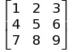
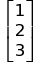
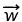
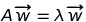
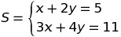
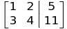

## Linear Algebra

> There is hardly any theory which is more elementary (than linear algebra), in spite of the fact that generations of professors and textbook writers have obscured its simplicity by preposterous calculations with matrices.

That's **exactly** what this submodule aims to simplify and automate while giving a visual interpretation of what it is doing.


# Table of contents

- [Some Very Basic Operations (**Adittion**, **Subraction**,**Multiplication** and Vector **Products**)](#TODO1)
- [Learning The fundamental Operations while finding the Eigen-Vectors and Eigen-Values of a Matrix](#TODO2)
   - [Finding the determinant and generating **N** dimensional identity Matrices](#TODO3)


The way to Declare a **Matrix** is by passing a **list of lists**, each representing the row of the collumn, while on the other hand you declare a **Vector** by passing in an array of arguments.

The **following** Matrix and Vector Instances:

- Matrix
>  
- Vector
> 

would be translated into this:

```python
from pythematics.linear import *

#Create a Matrix passing rows
A = Matrix([
    [1,2,3],
    [4,5,6],
    [7,8,9]
])
# Or if you wanted to do the same with collumns
A_col = CreateMatrixPassingCollumns([
    [1,4,7],[2,5,8],[3,6,8]
])
# Declaring a Vector
B = Vector([
    1,2,3
])
```
And thus the Output would be a nice visual representation 

```cpp

 // Matrix A and A_col

 CI |   C1        C2         C3
 R1 |   1          2          3
 R2 |   4          5          6
 R3 |   7          8          8

3 x 3 Matrix

// The Vector

R1|   1
R2|   2
R3|   3

3 x 1 Vector array
```

Matrix-Vector Operations such as **Multiplication**, **Addition** and **Subtraction** are defined as they are used in Mathematics

- You can Only Multiply two **Matrices** **A** and B if the number rows of **A** is equal to the number of **collumns** of **B**.
- You can **Add** two **Matrices** **A** and **B** if they have the exact same dimensions (Rows,Collumns)
- The above also applies for Matrix **Subtraction**

- The only operation you can Perform with a **scalar** is multiplication (**Scaling** a Matrix)

The same **rules** apply to **Vectors** (Same dimensions for **Add (+)** AND **Sub (-)** and Only multiplication by a **scalar**) with The only Exception that there are 2 ways you can Multiply Vectors Togther:

- **Dot Product** outputs a Scalar

- **Cross Product** outputs another Vector

The **Dot** Product is well defined in any dimensions but the **Cross** Product if we stick to linear algebra is only defined on **3D** space (sometimes in **7D**) but can be generalised using complex math such as **Octanions** or **Quaternions**

To avoid **confusion** the cross Product of two Vectors remains in **3 Dimensions**

```python
A = Matrix([
    [1,2],
    [3,4]
])

B = Matrix([
    [1,2,3,4],
    [5,6,7,8]
])

w = Vector([
    1,2,3
])

v = Vector([
    4,5,6
])

angle = (w*v) / (magnitude(w)*magnitude(v)) #Or if you like
angle = w.dot(v) / (magnitude(w)*magnitude(v))

from pythematics.trigonometric import arccos #For Computing the angle

print(A*B) #WARNING : B*A is not the same!
print(A+A) #SAME DIMENSIONS 
print(w.cross(v)) #The Cross product of w and v
print(arccos(angle)) #The angle between Vector w and v in radians

```
- **Output**

```c

// A*B

 CI |   C1        C2         C3         C4
 R1 |  11         14         17         20
 R2 |  23         30         37         44

2 x 4 Matrix

// A + A (same as 2*A)

 CI |   C1        C2
 R1 |   2          4
 R2 |   6          8

2 x 2 Matrix

//Cross Product

R1|  -3
R2|   6
R3|  -3

3 x 1 Vector array

0.22375608124549928 //The Angle in radians
```


## Learning the operations by finding the Eigen Vectors - Values of a Matrix

What [Eigen-Vectors](https://en.wikipedia.org/wiki/Eigenvalues_and_eigenvectors) and [Eigen-Values](https://en.wikipedia.org/wiki/Eigenvalues_and_eigenvectors) are does not really matter as we only need the Algorithm to compute them since many of the fundamental operations are Involved in this process.

> Eigen-Vector of a square Matrix **A** is a Vector  that when multiplied by a scalar **λ** it produces the same result as multiplying that scalar **λ** with Matrix **A**. Mathematically :  , where both sides are Vectors

The Method for computing them for an **NxN** Matrix goes as follows

>Find The **Characteristic-Polynomial** of that Matrix by doing the following steps:
   - Multiply The n dimensional **Identity Matrix** with **λ** (**λ** here acts as a Polynomial) and subtract the result from **A**
   - Find the Determinant of the Matrix generated above

The determinant will return a **Polynomial** (as the name suggests) whose **roots** are the **eigen-values** of the Matrix **A**.

> Proceed with the following steps
* Compute the roots of the **Characteristic-Polynomial** and store them in memory in an array as **roots**
* Get the Matrix from the very first step **A**-(**λ** * **Identity Matrix**) store it in memory as **sub**

Now Perform the following steps (in pseudo-code)

```python
EIGEN_VALUES_AND_EIGEN_VECTORS = {}

for every root in roots: #The roots of the Characteristic Polynomial
    Substitute the root in Matrix "sub" wherever you see lamda #Matrix sub if you remember has Polynomial Values
    Solve the system represented in substituted Matrix "sub" by setting as the desired output the "zero-vector"      
    Take the results of the system above and put them inside a Vector
    #Each eigen value has a corresponding eigen vector
    Insert into "EIGEN_VALUES_AND_EIGEN_VECTORS" the root with a key of the Above Vector {root : Vector} 
```
That's it, if you did not understand any steps, no worry, you can continue and see the real code

### Using The Real Code

First we need to make a function that finds the **Characteristic-Polynomial** but because we need to perform operations with **Polynomials** we need to import the coresponding module (if you want more info about Polynmials check [here](#TODO))

```python
import pythematics.linear as lin #For Matrix-Vector stuff
import pythematics.polynomials as pl #Working with Polynomials

x = pl.x #Instead of lamda we are going to use x
```

Now we need to find a Way to get the Identity matrix of **N** dimensions and also find a **determinant**, and luckily, there exists a function `IdenityMatrix` and a `determinant` one, and also all the Matrix operations are also defined so we are **OK**

```
def characteristic_polynomial(square_matrix : Matrix): 
    assert square_matrix.is_square() #DO NOT FORGET TO CHECK IF THE MATRIX IS SQUARE
    A = square_matrix 
    dimensions : int = A.__len__()[0] #Returns (Rows,Collumns) either will do, (square-matrix they're equal)
    identity_matrix : Matrix = IdenityMatrix(dimensions) #The Idenity Matrix
    polynomial_matrix : Matrix = A - (x * identity_matrix) #Subtract the scaled matrix from A
    det : pl.Polynomial = scaled_matrix.determinant() #Find the Determinant
    return det,polynomial_matrix 
```

Here I'm declaring the type of each variable so as for the code to make more sense

- `A.__len__()` returns the dimensions of the matrix but because it is square, they are exactly the same
- `A - (x * identity_matrix)` Operations with normal numbers as well as Polynomials are well defined
- `det` which is the determinant of `polynomial_matrix ` will produce a Vector

- `return det,polynomial_matrix` We need both the **Polynomial** and the **Matrix** for further computations (see above)


> Do not forget that `.determinant()` (or `determinant(matrix)` if you wish) is only possible if the Matrix has the **same** number of **rows** and **collumns** - **Square** Matrix

Now we need to define our function that actually finds the Eigen-Values and for that we need
 1. Another function for  finding the **roots** of the Polynomial which are the **Eigenvalues**
 2. A Method to Solve a system of linear equations which will give us the **Eigenvectors** 

The corresponding methods are `.roots` for the **Polynomials** and `.solve` for the **Eigenvectors** and Specifically

> `matrix.solve(unknowns : Union[tuple,list],output : Vector)`, We need to provide a tuple or a list containing the names of the variables we need to solve for and the desired output we want to get

To better understand how the `.solve()` method works consider the following system of equations

>  

If you were to solve this system using **Cramer's Method**  (`SolveCramer`) or by **Row-Reduction** (`solveREF`) You would Probably Write the system of equations in the following **Matrix** format in a similar or exactly this format

> 

and here that's exatcly what you need to pass but in a slightly different format

- The outputs **5** and **11** as a `Vector`
- the unknowns **x** and **y** as a **list** or a **tuple** `('x','y')`

```python
import pythematics.linear as lin

A = lin.Matrix([ #The Coefficient Matrix
    [1,2],
    [3,4]
])

unknowns = ('x','y') #The Unknowns
output = lin.Vector([5,11]) #The output that will make the augemented Matrix
solution1 = A.solve(output,unknowns)
solution2 = A.solve(output,unknowns,useRef=True)
print(solution1)
print(solution2)
```
Here we in `solution2` we are setting `useRef=True` which means that we are solving the system by row reduction while on `solution1` we are using **Cramer's** method of the determinants, and in both cases the result is the same of-course

> `{'x': 1.0, 'y': 2.0}`

or if you for whatever reason do not like the class-method of doing it you can instead use

```
cramer = lin.SolveCramer(A,output,unknowns) 
reduction = lin.solveREF(A,output,unknowns)
```

In general `useRef=True` or if you like `solveREF` is more powerful that `solveCramer` in situations where there are infinitely many solutions, since **Cramer's Method** fail's if you specify the parameter `ContinueOnFail=True` it will solve the remaining equations pick a somewhat random value for the **free** variable (By Default it is set to 1) which you can of course change if you explicitely call `solveREF` and set the parameter `onFailSetConst`. if there are **NO** (Rank of **Coefficient** Matrix is less than rank of **Augemented** Matrix) solutions it will through an `AssertionError`